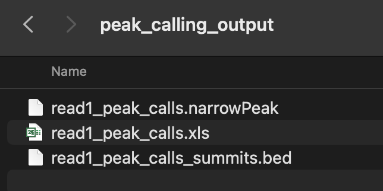
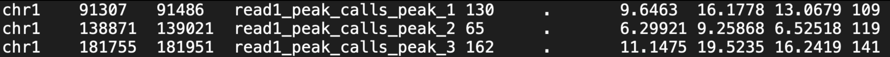
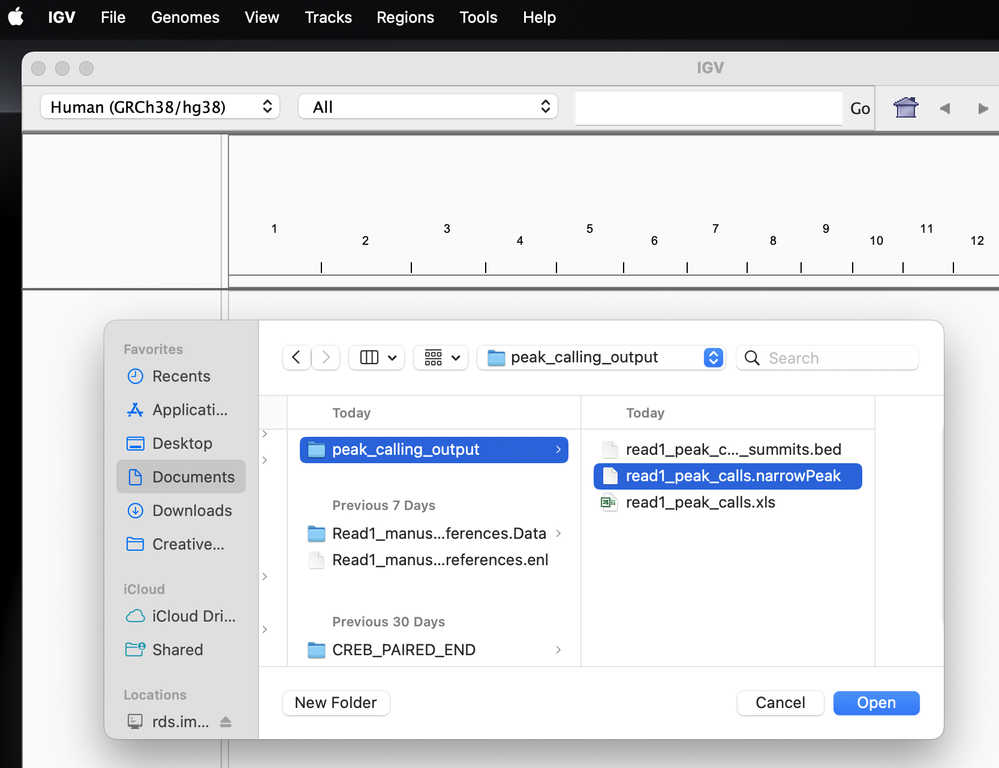
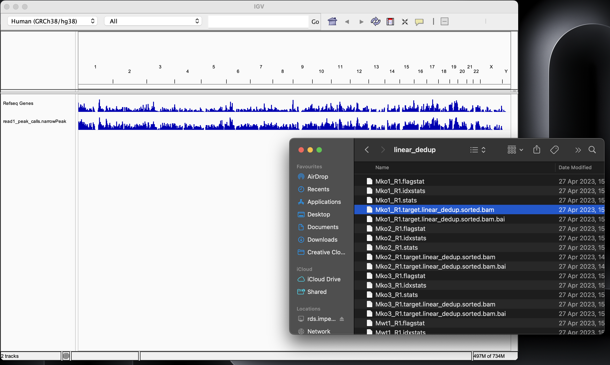
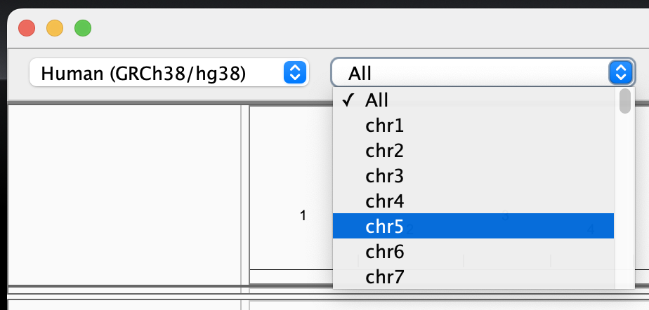
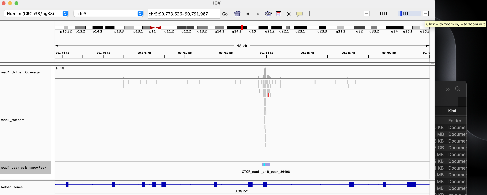

### Introduction

This is a comprehensive guide for performing TIP-seq peak calling using
MACSr (an R wrapper for the peak caller MACS). You will learn how to
call peaks with MACSr, including the parameters that need to be tuned
and their relevance to TIP-seq. This tutorial forms part of a series
designed to help researchers process and analyse TIP-seq data. Other
tutorials include:

1.  **Storing Epigenomic Data on HPC:** This tutorial details the
    process of storing your raw and processed data on Imperial's
    High-Performance Computing (HPC) system. It covers steps from
    creating data folders to downloading data from sequencing
    facilities.
2.  **Processing TIPseq Data Using nf-core/cutandrun on HPC:** This
    tutorial provides a detailed workflow for analysing TIP-Seq data
    using the nf-core/cutandrun pipeline. It includes steps for logging
    into the HPC, creating a samplesheet, adjusting parameters, running
    the pipeline, and checking outputs.

### Background

Peak calling is the process of identifying regions of the genome
enriched for sequence reads. In the context of TIP-seq, a peak
represents the binding of your target protein (either a transcription
factor or histone). These proteins can be separated into two classes
based on the size of the physical "marks" they leave on the genome.
Transcription factors and some histones, such as H3K27ac, are
characterised by **narrow**, well-defined peaks, whereas the peaks of
histones like H3K4me3, H3K9ac, and H3K27me3 are **broad**. It is
important to know which class your target protein belongs to, as it
comprises one of the arguments in the peak calling command.

In this tutorial, peak calling will be performed using Binary Alignment
Map (BAM) files, which contain aligned sequence reads and their
associated metadata (e.g. like alignment quality or, if paired-end
sequencing has been performed, whether a read is the first or second
mate in the read pair). If you have processed your TIP-seq data using
the nf-core/cutandrun pipeline, which this tutorial assumes, you will
always use BAM files for peak calling (if you have BAM files from
another source, you will want to skip Step 2). We also assume that you
have a single sample (no replicates). Where you have multiple replicates
of a narrow mark protein, you will want to perform consensus peak
calling with IDR in place of the simple peak calling detailed here (i.e.
you will want to skip Step 3). An IDR peak calling tutorial is under
development. If you have multiple replicates of a broad mark protein,
you should follow all steps of this tutorial with each replicate.

<br>

### **Step 1: Installing all dependencies and packages.**

1.  **Install R and RStudio.**

-   Downloading R: <https://cran.rstudio.com/>
-   Downloading RStudio: <https://posit.co/download/rstudio-desktop/>

2.  **Install Xcode (MAC users only).**

    ```{bash, eval = FALSE}
    xcode-select --install
    ```

    There will be simple on-screen instructions for you to follow to
    complete the installation.

3.  **Installing MACSr and Rsamtools.**

    Open up RStudio and enter:

    ```{r, eval = FALSE}
    if (!require("BiocManager", quietly = TRUE))
    install.packages("BiocManager")

    BiocManager::install("MACSr", force = TRUE) # For peak calling
    BiocManager::install("Rsamtools") # For filtering paired-end BAM files
    ```

<br>

### **Step 2: Accessing TIP-seq data on the HPC.**

If you have successfully followed the "Processing TIPseq Data Using
nf-core/cutandrun on HPC" tutorial, you will have BAM files in the
pipeline's output directory. These BAM files are used for peak calling,
and they can be accessed in the following way.

1.  **Mount the RDS on your local machine.**

    From your desktop, enter `CMD+K` to bring up the "Connect to Server"
    window. Alternatively, navigate to the menu bar at the top of your
    desktop and click *Go \> Connect to Server*.

    <center>

    

    </center>

    \
    Copy and paste the following text into the text field, replacing
    **username** with your Imperial username:

    [**smb://rds.imperial.ac.uk/RDS/user/username**](smb://rds.imperial.ac.uk/RDS/user/username)

    Enter your Imperial password when prompted.

2.  **Navigate to the experiment folder.**

    Move through *projects \> neurogenomics-lab \> live \> Data \>
    tip_seq \> processed_data* and open the folder that corresponds to
    your experiment. In the image below, we have navigated to the
    *tipseq_14_01_nov_2022* experiment.

    After entering the correct experiment folder, the BAM files you need
    for peak calling will be stored in *02_alignment \> bowtie2 \>
    target \> linear_dedup.*

    <center>

    

    </center>

    <br>

3.  **Specify the full path to the BAM file(s) from RStudio.**

    When you have identified the BAM file(s) that you wish to use for
    peak calling, head back over to RStudio and store the path string in
    a variable:

    ```{r, eval = FALSE}
    bam_file <- "/Volumes/USERNAME/projects/neurogenomics-lab/live/Data/tip_seq/processed_data/EXPERIMENT_NAME/02_alignment/bowtie2/target/linear_dedup/FILE_NAME.bam"
    ```

<br>

### **Step 3: Calling peaks using MACSr.**

1.  **Filter the paired-end BAM file to remove the secondary mate.**

    All of the TIP-seq data experiments performed to date (July 2024)
    used paired-end sequencing, though the lab has realised that only
    single-end reads are necessary for accurate peak calling. Therefore,
    this first step filters a paired-end BAM file to remove all
    secondary mates.

    Copy and paste this function into your RStudio script:

    ```{r, eval = FALSE}
    filter_bam <- function(bam_file, out_dir) {

      norm_out_dir <- normalizePath(out_dir, mustWork = TRUE)
      bam_file <- normalizePath(bam_file)

      index_destination <- file.path(norm_out_dir, paste0("read1_", basename(bam_file), ".bai")) # index should be in the same directory as the main file

      if (!file.exists(paste0(bam_file, ".bai"))) {
        bam_index <- indexBam(bam_file, destination = index_destination)
      } else {
        bam_index <- paste0(bam_file, ".bai")
      }

      bam_index <- normalizePath(bam_index)

      # Define parameters for filtering first mate reads
      param <- ScanBamParam(
        what = scanBamWhat(),
        flag = scanBamFlag(isFirstMateRead = TRUE)
      )

      destination <- file.path(norm_out_dir, paste0("read1_", basename(bam_file)))

      filterBam(
        file = bam_file,
        destination = destination,
        index = bam_index,
        param = param
      )

      return(destination)
    }
    ```

    Next, run the function on your paired-end BAM file with the
    following line:

    ```{r eval = FALSE}
    read1_bam_file <- filter_bam(bam_file = bam_file,
                                 outdir = "/Volumes/USERNAME/projects/neurogenomics-lab/live/Data/tip_seq/processed_data/EXPERIMENT_NAME/02_alignment/bowtie2/target/linear_dedup/")
    ```

    We recommend setting the `outdir` argument (the location the
    filtered BAM file will be saved) to the directory on the HPC that
    the paired-end BAM files are located. This way, all of the BAM files
    from a given experiment are stored together and can be found easily
    by future lab members. The path to the filtered BAM file will be
    stored in the variable `read1_bam_file`.

2.  **Run the MACSr `callpeak` command.**

    ```{r, eval = FALSE}

    MACSr::callpeak(
      tfile = read1_bam_file, 
      nomodel = TRUE, 
      qvalue = 0.01, 
      shift = -75, 
      extsize = 150, 
      keepduplicates = "all",
      broad = FALSE, # use TRUE if the target protein is a broad mark histone
      format = "BAM", 
      name = "read1_peak_calls", 
      outdir = "/Users/sonic/Documents/peak_calling_output/" 
      )
    ```

    #### **Parameters**

    | Parameter        | Purpose                                                                                                                                                                                                                 |
    |------------------|-------------------------------------------------------------------------------------------------------------------------------------------------------------------------------------------------------------------------|
    | `tfile`          | Specifies the path to the treatment file (e.g. BAM file).                                                                                                                                                               |
    | `nomodel`        | By default, MACS builds a ChIP-seq specific model. We disable this model for TIP-seq by setting the parameter to `TRUE`.                                                                                                |
    | `qvalue`         | The significance threshold (adjusted for multiple testing). Typical values are 0.05 or 0.01.                                                                                                                            |
    | `shift`          | An integer value denoting the number of base pairs the cut sites should be shifted. Negative values mean a 5' shift whereas positive values mean a 3' shift. For TIP-seq, this value should be set to `-0.5 * extsize`. |
    | `extsize`        | Used in conjunction with `shift` to extend reads to fix-sized fragments.                                                                                                                                                |
    | `keepduplicates` | Keep all duplicate reads. The nf-core/cutandrun pipeline will have already removed duplicates.                                                                                                                          |
    | `broad`          | Are the marks broad or narrow? For transcription factors and some histones like H3K27ac, you will want to set this argument to `FALSE`. For most histones, set this to `TRUE`.                                          |
    | `format`         | Specifies the format of the input files.                                                                                                                                                                                |
    | `name`           | The prefix for all output files.                                                                                                                                                                                        |
    | `outdir`         | Specifies the output directory where results will be saved. We recommend specifying the path to a folder on your computer.                                                                                              |

    ------------------------------------------------------------------------

    #### **Output files**

    Three files will be generated in the output directory:

    

    <br>

    -   The `.narrowPeak` file is in 6+4 BED (10 columns) format and
        contains all peak information. This is the file that you will
        use for visualisation. <br>

   
   
   Looking at the top row of the above screenshot, we can see there is
    a peak on chromosome 1 (column 1) with the coordinates 91,307-91,486
    (column 2 & 3). This peak has a -log10 p-value of 16.1778 (column
    8), and the point of highest enrichment, referred to as the
    *summit*, has a relative position within the peak of 109 (column
    10). Note that MACS will generate a `.broadPeak` file in 6+3 BED (9
    columns) format if `broad = TRUE`. This is identical to the
    `.narrowPeak` file, except there is NO relative summit position
    column.

  To clarify, the main features of the file are:

  | Column   | Description                                                                                                                            |
  |----------|----------------------------------------------------------------------------------------------------------------------------------------|
  | 1        | The chromosome the peak is on.                                                                                                         |
  | 2 & 3    | The start and end coordinates of each peak.                                                                                            |
  | 7, 8 & 9 | The signal strength, -log10 p-value and -log10 q-value. These are just different measures of significance.                             |
  | 10       | The relative summit position. The start coordinate (column 2) + the relative summit will give you the absolute position of the summit. |

  -   The `.xls` file is most useful if you cannot remember the
      command used to call the peaks. At the top of the file are the
      parameter settings.

  -   The `summits.bed` file contains the coordinates of each peak
      summit. This file is NOT created if `broad =  TRUE`.

  For comprehensive details of all parameters and output files, see
  the [MACS manual](https://pypi.org/project/MACS2/).

  Note that we do not use controls for TIP-seq peak calling, because
  of the way they are handled by MACS. Where there is a difference in
  sequence depth between the treatment and control files, MACS
  linearly scales the larger sample to the same read depth as the
  smaller sample. This has proved problematic for TIP-seq, as the
  control files we generate have very low read counts relative to the
  treatment files, even though we ask for them to be sequenced to the
  same depth. As a result, scaling removes much of the signal in the
  treatment file and peak calling is overly conservative.

<br>

### **Step 4: Visualising the MACSr output.**

The first thing you should do after peak calling is visualise the output
in IGC (Integrative Genomics Viewer). This is a simple way to get a feel
for how sensible your results are.

1.  **Download IGV.**

    Visit the IGV web page (<https://igv.org/>) and download the
    appropriate desktop application.

2.  **Loading peak files into IGV.**

    First, select the genome build in the top left drop down menu. This
    will be the same genome build that was used when processing the data
    with the nf-core/cutandrun pipeline.

    <center>

    

    </center>

    Go to *file \> Load from file...* and select the `.narrowPeak` file
    from the output directory (this is the 6+4 BED file with all of the
    peak information).

    

    <br>

3.  **Loading BAM files into IGV.**

    Following the instructions from **Step 2: Accessing TIP-seq data on
    the HPC**, you want to mount the RDS on your local machine and
    navigate to the desired TIP-seq experiment. Find the BAM file that
    you used to call your peaks, and drag and drop the file into IGV:

    

    \
    Alternatively, if the BAM files are just stored on your laptop, go
    to *file \> Load from file...*

    <br>

4.  **Navigating the peaks and reads.**

    Once you have loaded the peak and BAM files, you will need to select
    a chromosome to view. This decision is typically arbitrary, unless
    there is a specific locus you would like to check:

    

    \
    With a chromosome selected, you can slide along the viewer and zoom
    into regions using the + and - buttons in the top right:

    

    [In this 18kb region, we see a well-defined pileup of reads (top
    track) that MACS has designated a peak (bottom track). We also see
    relatively little background noise surrounding this signal.]

    \
    The top track in this view shows the aligned reads. If you double
    click on this track, you will be presented with options for
    colouring/sorting (e.g. coloured by read strand).

    The track below this shows the peaks. The vertical cyan line within
    each peak is the summit, which denotes the exact nucleotide where
    read pileup is highest (the summit will be absent if you have used
    the broad setting).
